#+options: ':nil *:t -:t ::t <:t H:3 \n:nil ^:t arch:headline
#+options: author:t broken-links:nil c:nil creator:nil
#+options: d:(not "LOGBOOK") date:t e:t email:nil expand-links:t f:t
#+options: inline:t num:t p:nil pri:nil prop:nil stat:t tags:t
#+options: tasks:t tex:t timestamp:t title:t toc:nil todo:t |:t
#+title: Taller de Configuracion de Entorno WSL
#+date: 2026-04-08

#+author:A-EVAN MATANGO
#+author:B-EDGAR ENDARA
#+author:C:JOSET MUELA
#+author:D-KAREN SUAREZ

#+language: Espanol
#+select_tags: export
#+exclude_tags: noexport
#+creator: Emacs 27.1 (Org mode 9.7.5)
#+cite_export:

#+latex_class: article
#+latex_class_options:
#+latex_header:
#+latex_header_extra:
#+description:
#+keywords:
#+subtitle:
#+latex_footnote_command: \footnote{%s%s}
#+latex_engraved_theme:
#+latex_compiler: pdflatex

#+latex_header: \usepackage{fancyhdr}
#+latex_header: \usepackage[top=25mm, left=25mm, right=25mm]{geometry}
#+latex_header: \usepackage{longtable}
#+latex_header: \fancyhead[R]{}
#+latex_header: \setlength\headheight{43.0pt}
#+LATEX_HEADER: \usepackage{tabularx}
#+LATEX_HEADER: \usepackage{longtable}

#+begin_export latex
\fancyhead[C]{\includegraphics[scale=0.05]{../images/logoEPN.jpg}\\
ESCUELA POLITECNICA NACIONAL\\FACULTAD DE INGENIERIA DE SISTEMAS\\
ARQUITECTURA DE COMPUTADORES}
\thispagestyle{fancy}
#+end_export

* Objetivos

- Configurar y validar el entorno de trabajo para la asignatura de Arquitectura de Computadores en Linux o WSL.
- Verificar la instalacion de herramientas base: mamba/anaconda (Python), Emacs y \LaTeX.
- Documentar evidencias tecnicas mediante capturas y comandos ejecutados.

* Instrucciones

1. Realice todas las actividades en Linux o en WSL.
2. En cada sección ejecute los comandos solicitados y registre la salida en el bloque correspondiente.
3. Guarde el archivo y exporte a pdf con el comando `org-latex-export-to-pdf`.
4. Verifique que estén todos los nombres de los integrantes del grupo
   de trabajo. Los grupos para este trabajo están en [[https://epnecuador.sharepoint.com/:x:/s/ICCD332-ArquitecturaComputadores/IQCjNuELSDbJTb42EfrLL2ksATBSbitbZ9_iFLJxIiCtSr0?e=gowv5I][Equipos de Trabajo]].
5. Verifique que en las distintas secciones de este archivo esté
   identificado con nombre e email el aporte del estudiante.

Si require insertar una imagen, crear una carpeta ~images~ y colocar
la imagen dentro. Para llamar la imagen desde Emacs use ~C-c C-l~ y
busque el archivo o escriba:Puede insertar una imagen con la sintaxis:

#+begin_src org
[[./images/image1.jpg]]
#+end_src
* Actividades
** Configuración de WSL con Ubuntu, \LaTeX, Python e Emacs

1. Verificacion de entorno mamba/anaconda
   1. Active WSL (si aplica) y su entorno de trabajo.
   2. Ejecute ~mamba info~ con ~C-c C-c~ dentro del bloque de código.
   3. Si el comando falla, active un entorno con ~mamba activate
      iccd332~ e intente de nuevo.
      

*** Estudiante: Evan

  #+begin_src shell :exports both :results verbatim
     mamba info
   #+end_src
   #+RESULTS:
   #+begin_example

	  libmamba version : 2.5.0
	     mamba version : 2.5.0
	      curl version : libcurl/8.19.0 OpenSSL/3.6.1 zlib/1.3.2 zstd/1.5.7 libssh2/1.11.1 nghttp2/1.68.1 mit-krb5/1.22.2
	libarchive version : libarchive 3.8.6 zlib/1.3.2 liblzma/5.8.2 bz2lib/1.0.8 liblz4/1.10.0 libzstd/1.5.7 liblzo2/2.10 openssl/3.5.5 libb2/bundled
	  envs directories : /home/evanmh-epn/miniforge3/envs
	     package cache : /home/evanmh-epn/miniforge3/pkgs
			     /home/evanmh-epn/.mamba/pkgs
	       environment : iccd332 (active)
	      env location : /home/evanmh-epn/miniforge3/envs/iccd332
	 user config files : /home/evanmh-epn/.mambarc
    populated config files : /home/evanmh-epn/miniforge3/.condarc
	  virtual packages : __unix=0=0
			     __linux=6.6.87=0
			     __glibc=2.39=0
			     __archspec=1=x86_64_v3
			     __cuda=12.7=0
		  channels : https://conda.anaconda.org/conda-forge/linux-64
			     https://conda.anaconda.org/conda-forge/noarch
	  base environment : /home/evanmh-epn/miniforge3
		  platform : linux-64
   #+end_example

   
*** Estudiante:Endara Sebastian
   #+begin_src shell :exports both :results verbatim
     mamba info
   #+end_src

   #+RESULTS:
   #+begin_example

	  libmamba version : 2.5.0
	     mamba version : 2.5.0
	      curl version : libcurl/8.19.0 OpenSSL/3.6.1 zlib/1.3.2 zstd/1.5.7 libssh2/1.11.1 nghttp2/1.68.1 mit-krb5/1.22.2
	libarchive version : libarchive 3.8.6 zlib/1.3.2 liblzma/5.8.2 bz2lib/1.0.8 liblz4/1.10.0 libzstd/1.5.7 liblzo2/2.10 openssl/3.5.5 libb2/bundled
	  envs directories : /home/edgar-epn/miniforge3/envs
	     package cache : /home/edgar-epn/miniforge3/pkgs
			     /home/edgar-epn/.mamba/pkgs
	       environment : iccd332 (active)
	      env location : /home/edgar-epn/miniforge3/envs/iccd332
	 user config files : /home/edgar-epn/.mambarc
    populated config files : /home/edgar-epn/miniforge3/.condarc
	  virtual packages : __unix=0=0
			     __linux=6.6.87=0
			     __glibc=2.39=0
			     __archspec=1=x86_64_v3
			     __cuda=13.1=0
		  channels : https://conda.anaconda.org/conda-forge/linux-64
			     https://conda.anaconda.org/conda-forge/noarch
	  base environment : /home/edgar-epn/miniforge3
		  platform : linux-64
   #+end_example

*** Estudiante:Joset Muela
   #+begin_src shell :exports both :results verbatim
     mamba info
   #+end_src

   #+RESULTS:
   #+begin_example

	  libmamba version : 2.5.0
	     mamba version : 2.5.0
	      curl version : libcurl/8.19.0 OpenSSL/3.6.1 zlib/1.3.2 zstd/1.5.7 libssh2/1.11.1 nghttp2/1.68.1 mit-krb5/1.22.2
	libarchive version : libarchive 3.8.6 zlib/1.3.2 liblzma/5.8.2 bz2lib/1.0.8 liblz4/1.10.0 libzstd/1.5.7 liblzo2/2.10 openssl/3.5.5 libb2/bundled
	  envs directories : /home/josetm-epn/miniforge3/envs
	     package cache : /home/josetm-epn/miniforge3/pkgs
			     /home/josetm-epn/.mamba/pkgs
	       environment : iccd332 (active)
	      env location : /home/josetm-epn/miniforge3/envs/iccd332
	 user config files : /home/josetm-epn/.mambarc
    populated config files : /home/josetm-epn/miniforge3/.condarc
	  virtual packages : __unix=0=0
			     __linux=6.6.87=0
			     __glibc=2.39=0
			     __archspec=1=x86_64_v3
			     __cuda=13.2=0
		  channels : https://conda.anaconda.org/conda-forge/linux-64
			     https://conda.anaconda.org/conda-forge/noarch
	  base environment : /home/josetm-epn/miniforge3
		  platform : linux-64
   #+end_example

*** Estudiante: Karen Suarez

    #+begin_src shell :exports both :results verbatim
     mamba info
   #+end_src
  
   #+RESULTS:
   #+begin_example
          active environment : iccd332
    active env location : /home/usuariokaren_suarez/miniforge3/envs/iccd332
            shell level : 2
       user config file : /home/usuariokaren_suarez/.condarc
 populated config files : /home/usuariokaren_suarez/miniforge3/.condarc
          conda version : 26.1.1
    conda-build version : not installed
         python version : 3.13.12.final.0
                 solver : libmamba (default)
       virtual packages : __archspec=1=skylake
                          __conda=26.1.1=0
                          __glibc=2.39=0
                          __linux=6.6.87.2=0
                          __unix=0=0
       base environment : /home/usuariokaren_suarez/miniforge3  (writable)
      conda av data dir : /home/usuariokaren_suarez/miniforge3/etc/conda
  conda av metadata url : None
           channel URLs : https://conda.anaconda.org/conda-forge/linux-64
                          https://conda.anaconda.org/conda-forge/noarch
          package cache : /home/usuariokaren_suarez/miniforge3/pkgs
                          /home/usuariokaren_suarez/.conda/pkgs
       envs directories : /home/usuariokaren_suarez/miniforge3/envs
                          /home/usuariokaren_suarez/.conda/envs
    temporary directory : /tmp
               platform : linux-64
             user-agent : conda/26.1.1 requests/2.32.5 CPython/3.13.12 Linux/6.6.87.2-microsoft-standard-WSL2 ubuntu/24.04.4 glibc/2.39 solver/libmamba conda-libmamba-solver/25.11.0 libmambapy/2.5.0
                UID:GID : 1000:1000
             netrc file : None
           offline mode : False
   #+end_example

2. Verificacion de Python
   1. Active el entorno ~iccd332~ para abrir Emacs con ~mamba activate iccd332~.
   2. Ejecute ~python --version~ en la consola y desde Emacs.

*** Estudiante Evan: 
   #+begin_src shell :exports both :results verbatim
    python --version
   #+end_src

   #+RESULTS:
   : Python 3.14.4

*** Estudiante Edgar Endara: 
   #+begin_src shell :exports both :results verbatim
    python --version
   #+end_src

   #+RESULTS:
   : Python 3.14.4
   

*** Estudiante :Joset Muela
   #+begin_src shell :exports both :results verbatim
    python --version
   #+end_src

   #+RESULTS:
   : Python 3.14.4

*** Estudiante Karen Suarez: 
   #+begin_src shell :exports both :results verbatim
    python --version
   #+end_src

   #+RESULTS
   : Python 3.14.4

   
3. Verificacion de Emacs
   Ejecute ~emacs --version~ en la consola y desde Emacs.

*** Estudiante Evan Matango:
   #+begin_src shell :exports both :results verbatim
   emacs --version
   #+end_src

   #+RESULTS:
   : GNU Emacs 29.3
   : Copyright (C) 2024 Free Software Foundation, Inc.
   : GNU Emacs comes with ABSOLUTELY NO WARRANTY.
   : You may redistribute copies of GNU Emacs
   : under the terms of the GNU General Public License.
   : For more information about these matters, see the file named COPYING.

*** Estudiante Edgar Endara:
   #+begin_src shell :exports both :results verbatim
   emacs --version
   #+end_src

   #+RESULTS:
   : GNU Emacs 29.3
   : Copyright (C) 2024 Free Software Foundation, Inc.
   : GNU Emacs comes with ABSOLUTELY NO WARRANTY.
   : You may redistribute copies of GNU Emacs
   : under the terms of the GNU General Public License.
   : For more information about these matters, see the file named COPYING.

*** Estudiante :Joset Muela
   #+begin_src shell :exports both :results verbatim
   emacs --version
   #+end_src

   #+RESULTS:
   : GNU Emacs 29.3
   : Copyright (C) 2024 Free Software Foundation, Inc.
   : GNU Emacs comes with ABSOLUTELY NO WARRANTY.
   : You may redistribute copies of GNU Emacs
   : under the terms of the GNU General Public License.
   : For more information about these matters, see the file named COPYING.

*** Estudiante Karen Suarez:

#+begin_src shell :exports both :results verbatim
   emacs --version
   #+end_src

   #+RESULTS:
  : GNU Emacs 29.3
  : Copyright (C) 2024 Free Software Foundation, Inc.
  : GNU Emacs comes with ABSOLUTELY NO WARRANTY.
  : You may redistribute copies of GNU Emacs
  : under the terms of the GNU General Public License.
  : For more information about these matters, see the file named COPYING.

4. Verificacion de LaTeX
   Ejecute ~latex --version~ en la consola y desde Emacs.

*** Estudiante Evan Matango:

   #+begin_src shell :exports both :results verbatim
   latex --version
   #+end_src

   #+RESULTS:
   #+begin_example
   pdfTeX 3.141592653-2.6-1.40.25 (TeX Live 2023/Debian)
   kpathsea version 6.3.5
   Copyright 2023 Han The Thanh (pdfTeX) et al.
   There is NO warranty.  Redistribution of this software is
   covered by the terms of both the pdfTeX copyright and
   the Lesser GNU General Public License.
   For more information about these matters, see the file
   named COPYING and the pdfTeX source.
   Primary author of pdfTeX: Han The Thanh (pdfTeX) et al.
   Compiled with libpng 1.6.43; using libpng 1.6.43
   Compiled with zlib 1.3; using zlib 1.3
   Compiled with xpdf version 4.04
   #+end_example
   
*** Estudiante Endara Sebastian:

   #+begin_src shell :exports both :results verbatim
   latex --version
   #+end_src

   #+RESULTS:
   #+begin_example
   pdfTeX 3.141592653-2.6-1.40.25 (TeX Live 2023/Debian)
   kpathsea version 6.3.5
   Copyright 2023 Han The Thanh (pdfTeX) et al.
   There is NO warranty.  Redistribution of this software is
   covered by the terms of both the pdfTeX copyright and
   the Lesser GNU General Public License.
   For more information about these matters, see the file
   named COPYING and the pdfTeX source.
   Primary author of pdfTeX: Han The Thanh (pdfTeX) et al.
   Compiled with libpng 1.6.43; using libpng 1.6.43
   Compiled with zlib 1.3; using zlib 1.3
   Compiled with xpdf version 4.04
   #+end_example

*** Estudiante :Joset Muela

   #+begin_src shell :exports both :results verbatim
   latex --version
   #+end_src

   #+RESULTS:
   #+begin_example
   pdfTeX 3.141592653-2.6-1.40.25 (TeX Live 2023/Debian)
   kpathsea version 6.3.5
   Copyright 2023 Han The Thanh (pdfTeX) et al.
   There is NO warranty.  Redistribution of this software is
   covered by the terms of both the pdfTeX copyright and
   the Lesser GNU General Public License.
   For more information about these matters, see the file
   named COPYING and the pdfTeX source.
   Primary author of pdfTeX: Han The Thanh (pdfTeX) et al.
   Compiled with libpng 1.6.43; using libpng 1.6.43
   Compiled with zlib 1.3; using zlib 1.3
   Compiled with xpdf version 4.04
   #+end_example

*** Estudiante Karen Suarez:

   #+begin_src shell :exports both :results verbatim
   latex --version
   #+end_src

   #+RESULTS:
   : pdfTeX 3.141592653-2.6-1.40.25 (TeX Live 2023/Debian)
   : kpathsea version 6.3.5
   : Copyright 2023 Han The Thanh (pdfTeX) et al.
   : There is NO warranty.  Redistribution of this software is
   : covered by the terms of both the pdfTeX copyright and
   : the Lesser GNU General Public License.
   : For more information about these matters, see the file
   : named COPYING and the pdfTeX source.
   : Primary author of pdfTeX: Han The Thanh (pdfTeX) et al.
   : Compiled with libpng 1.6.43; using libpng 1.6.43
   : Compiled with zlib 1.3; using zlib 1.3
   : Compiled with xpdf version 4.04

5. Registro de problemas y solucion aplicada

Complete la siguiente tabla si tuvo errores durante la configuración:

#+ATTR_LATEX: :environment tabularx :width \textwidth :align lXX
| *Herramienta* | *Problema observado* | *Solucion aplicada* |
|---------------+----------------------+---------------------|
|               |                      |                     |
|               |                      |                     |
|               |                      |                     |

** Comandos Emacs Tutorial
Seguir el tutorial integrado en Emacs al respecto de la navegación y
operaciones más frecuentes. El tutorial puede ser accedido en Español
utilizando el comando:

#+begin_src emacs-lisp
M-x help-with-tutorial-spec-language
#+end_src

Realice los ejercicios del tutorial (al menos un 80% del texto) y
complete la siguiente tabla con los comandos que considere de mayor
interés. Verifique que en la parte superior se active el menú de
tabla. Dentro de la región de la tabla puede dar C-c C-c para alinear
automáticamente la tabla al contenido del texto que escriba. Para
generar una nueva fila escriba presione la tecla TAB

<Estudiante A Evan Matango>
#+ATTR_LATEX: :environment longtable :align |p{0.2\linewidth}|p{0.3\linewidth}|p{0.2\linewidth}|p{0.3\linewidth}|
| *Comando*         | *Descripción*               | *Comando*   | *Descripción*                     |
|-------------------+-----------------------------+-------------+-----------------------------------|
| ~C-c C-e # latex~ | Insertar template de  latex | ~C-x C-s~   | Guardar los cambios en el archivo |
| ~C-x k~           | Matar un buffer             | ~C-/~       | Deshace una acción                |
| ~C-x 1~           | Cerrar una ventana          | ~C-h k C-f~ | Saber que hace un comando         |
| ~C-x C-b~         | Ver los buffers             | ~M-k~       | Borrar una línea                  |

<Estudiante Edgar Endara>
#+ATTR_LATEX: :environment longtable :align |p{0.2\linewidth}|p{0.3\linewidth}|p{0.2\linewidth}|p{0.3\linewidth}|
| *Comando* | *Descripción*     | *Comando* | *Descripción*               |
|-----------+-------------------+-----------+-----------------------------|
| ~C-g~     | Cancelar comando  | ~C-l~     | Centrar cursosr en pantalla |
| ~C-x C-f~ | Abrir archivo     | ~C-x u~   | Deshacer                    |
| ~C-x C-t~ | Transponer líneas | ~M-w~     | Copiar región               |

<Estudiante Joset Muela>
#+ATTR_LATEX: :environment longtable :align |p{0.2\linewidth}|p{0.3\linewidth}|p{0.2\linewidth}|p{0.3\linewidth}|
| *Comando*         | *Descripción*               | *Comando* | *Descripción*                     |
|-------------------+-----------------------------+-----------+-----------------------------------|
| ~C-c C-e # latex~ | Insertar template de  latex | ~C-x C-s~ | Guardar los cambios en el archivo |
| ~C-g~             | Cancelar comando            | ~C-x u~   | Deshace una acción                |
| ~C-x C-b~         | Lista de buffers            | ~C-x b~   | Cambiar a otro buffer             |
| ~C-x C-f~         | Encontrar un archivo        | ~C-x 1~   | Borrar todo menos una ventana     |

<Estudiante D Karen Suarez >
#+ATTR_LATEX: :environment longtable :align |p{0.2\linewidth}|p{0.3\linewidth}|p{0.2\linewidth}|p{0.3\linewidth}|
| *Comando*                          | *Descripción*                                 | *Comando* | *Descripción*                                |
|------------------------------------+-----------------------------------------------+-----------+----------------------------------------------|
| ~C-c C-e # latex~                  | Insertar template de  latex                   | ~C-x C-s~ | Guardar los cambios en el archivo            |
| ~C-x r SPC #Registros y Bookmarks~ | Guardar posición en registro                  | ~C-x 1~   | Para abrir todo el texto en una sola ventana |
| ~C-d #Insertar y borrar~           | Borra el caracter que esta despues del cursor | ~C-x C-f~ | Para encontrar el archivo                    |
| ~C-x C-b #buffers~                 | Ayuda a ver la lista de buffers               | ~C-x 2~   | Ayuda a separar la pantalla en dos ventanas  |
** Comandos Emacs Juego
En la anterior sección usted revisó los comandos de mayor interés
sobre la manipulación de Emacs. Es hora de poner en práctica sus
conocimientos. Realice unas 3 visitas al juego  [[https://chat.qwen.ai/s/deploy/t_23ff57ef-b59a-4bd7-9b79-54679b33686d][Emacs-Trainer]] y apunte
en la siguiente tabla su puntaje.

Estudiante A:Evan Matango 
|-----------+---------|
| iteración | Puntaje |
|-----------+---------|
|         1 |   107   |
|         2 |   130   |
|         3 |   140   |
|-----------+---------|
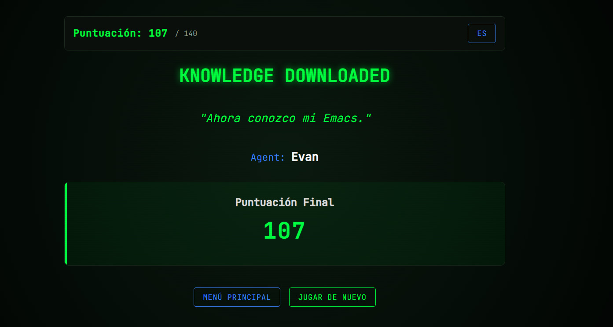
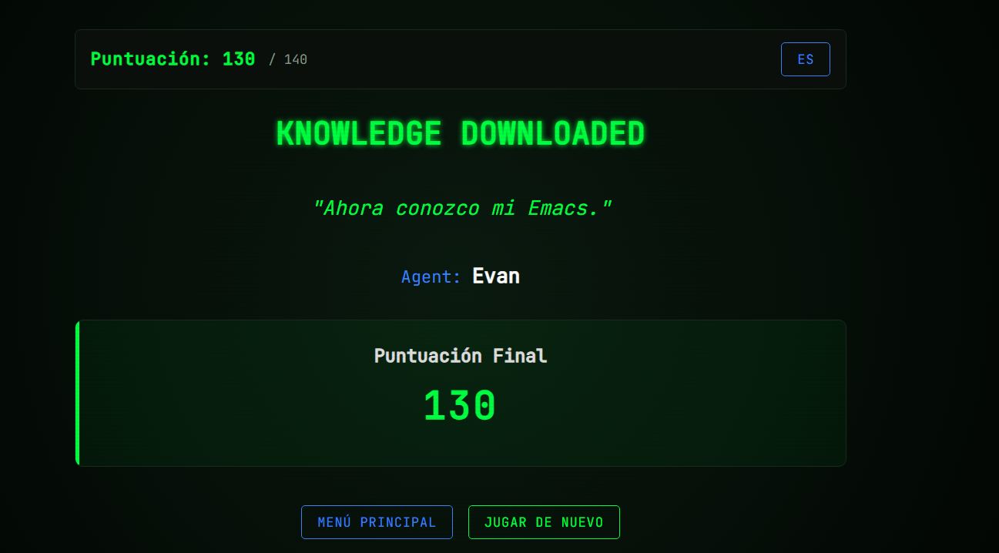
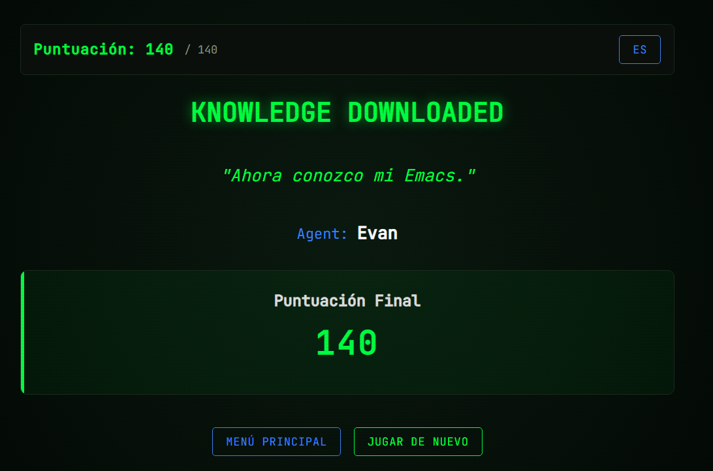

Estudiante B: Endara Sebastian
|-----------+---------|
| iteración | Puntaje |
|-----------+---------|
|         1 |   140   |
|         2 |   130   |
|         3 |   130   |
|-----------+---------|

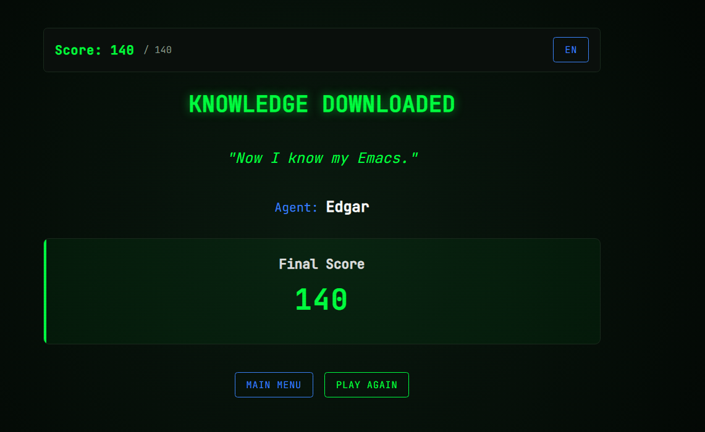
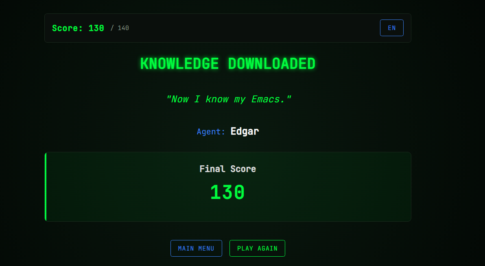
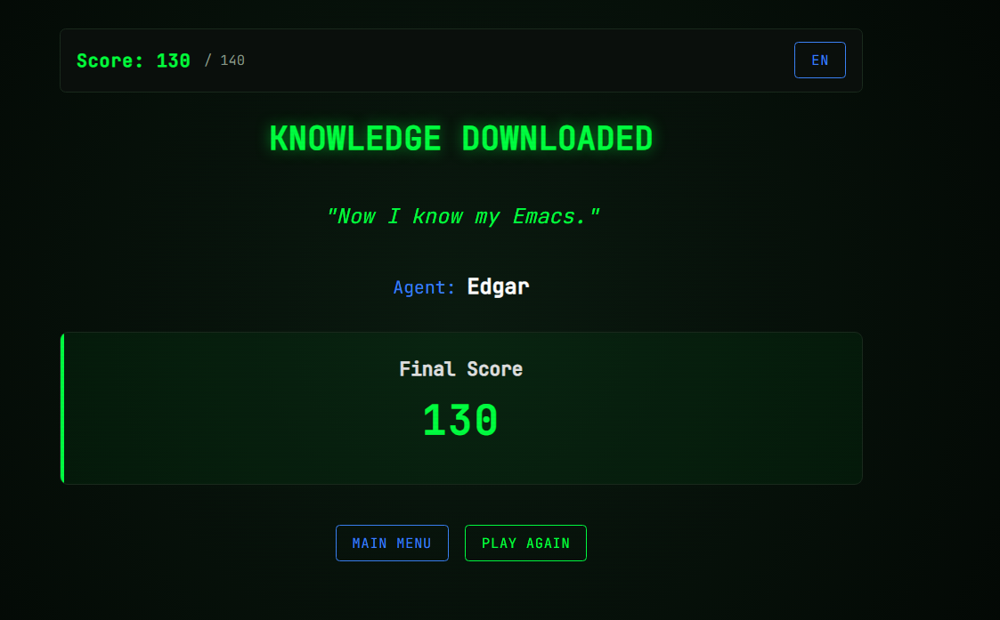

Estudiante C: Joset Muela
|-----------+---------|
| iteración | Puntaje |
|-----------+---------|
|         1 |    96   |
|         2 |   126   |
|         3 |   120   |
|-----------+---------|

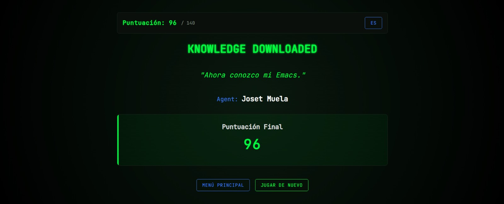
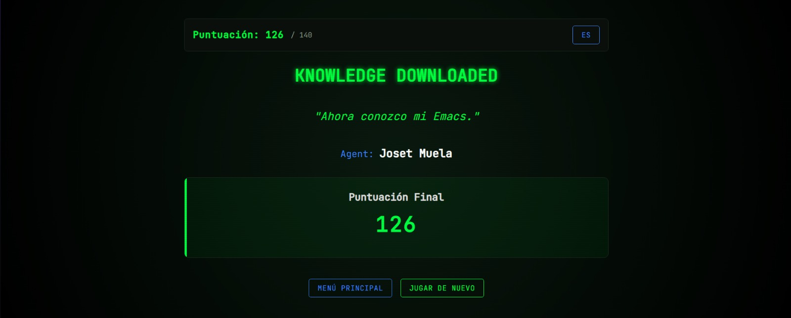
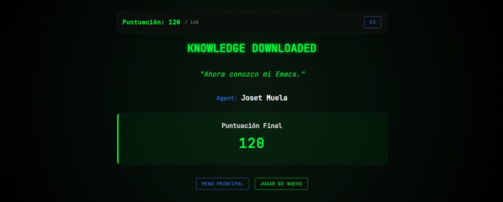

Estudiante D: Karen Suarez
|-----------+---------|
| iteración | Puntaje |
|-----------+---------|
|         1 |   77    |
|         2 |   130   |
|         3 |   130   |
|-----------+---------|

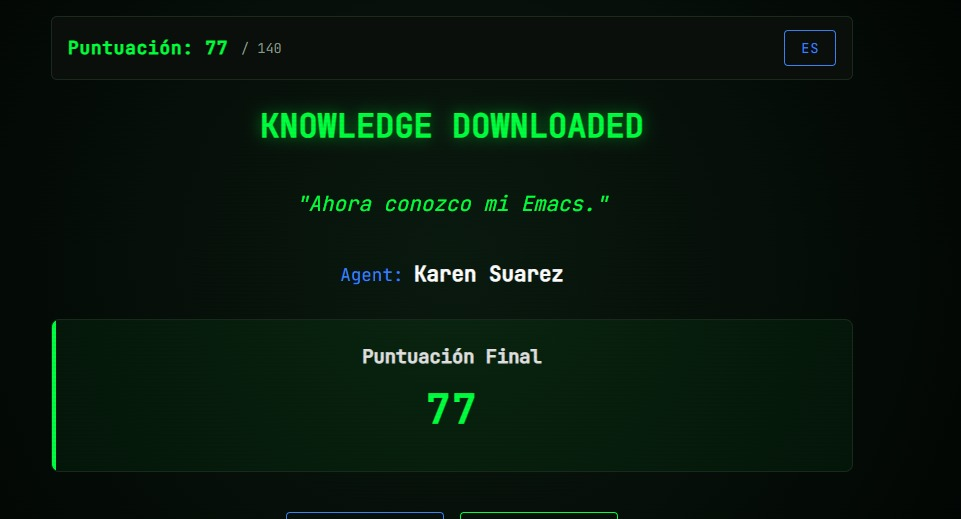
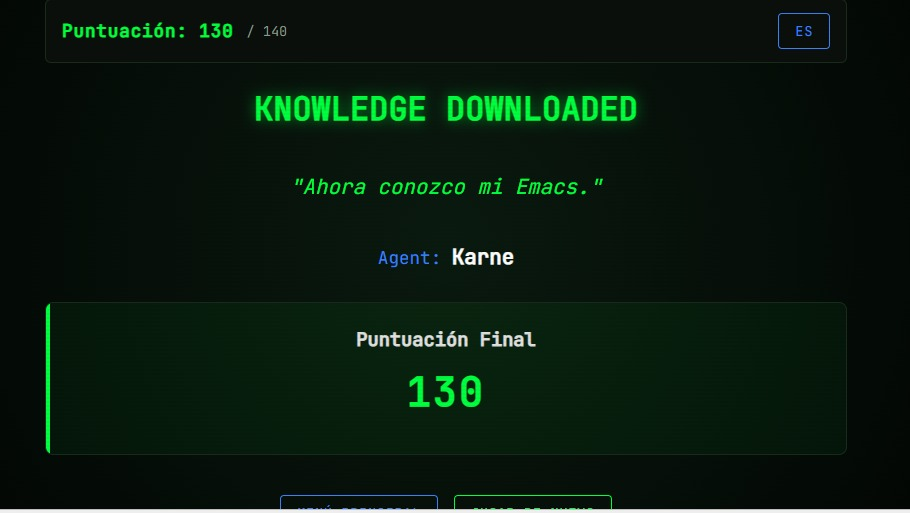

 
** Usando Emacs para tener Ayuda sobre Emacs
¿Qué comandos le resultan más fáciles de usar y cuáles le son más
extraños? Identifique 4 comandos que le sean fáciles y 4 que le
resulten complicados. Revise qué dice la ayuda de Emacs sobre cada
comando y escriba en sus palabras el para qué sirve.

Para consultar lo que hace un comando ejecute:
1. ~C-h k~
2. Emacs le preguntara cuál es la combinación de la que requiere
   ayuda. Presione las teclas del comando. Por ejemplo, ~C-x C-f~
3. Emacs abrirá un nuevo buffer con la descripción del comando.
4. Cambie al buffer de la ayuda con ~C-x o~
5. Seleccione el primer parrafo de ayuda ubicando el cursor al inicio
   del parrafo y activando la marcación de texto con
   ~C-SPC~. Seleccione avanzando por palabras ~M-f~ o directamente
   toda la linea ~C-e~
6. Una vez seleccionado, copie el texto con ~M-w~.
7. Regrese al buffer anterior con ~C-x o~.
8. Pegue el texto en <Pegar lo que dice el...> con ~C-y~

**Comandos Fáciles**
1. **Evan Matango:** <C-f>. <Mover un espacio el cursor>
2. **Estudiante B:** <Poner el comando>. <Pegar lo que dice el primer párrafo de la ayuda>
3. **Joset Muela:**  <C-x C-s> <Guaradar un archivo>
4. **Karen Suarez** ~C-x C-f~:C-x C-f runs the command find-file (found in global-map), which is an
interactive native-compiled Lisp function in ‘files.el’. 

**Comandos Difíciles**
1. **Estudiante A:** <C-x k>. <Matar un buffer>
2. **Estudiante B:** <Poner el comando>. <Pegar lo que dice el primer párrafo de la ayuda>
3. **Joset Muela:**  <C-s> <Guaradar varios buffers>
4. **Karen Suarez** ~C-x c-b~:C-x C-b runs the command list-buffers (found in global-map), which is
an interactive native-compiled Lisp function in ‘buff-menu.el’
 

* Equipo de Trabajo
Complete la información de los integrantes de grupo e indique el líder
de grupo.

|--------------+---------------------------+-------------|
| Nombre       | email                     | Rol         |
|--------------+---------------------------+-------------|
| Evan Matango | evan.matango@epn.edu.ec   | líder       |
| Edgar Endara | edgar.endara@epn.edu.ec   | colaborador |
| Karen Suarez | karen.suarez01@epn.edu.ec | colaborador |
| Joset Muela  | joset.muela@epn.edu.ec    | colaborador |
|--------------+---------------------------+-------------|

* Verificación de Entregables [100%]:
Ejecute ~C-c C-c~ sobre los ítems de tarea según se hayan cumplido o
no. Si un ítem no pudo realizarse apunte en la siguiente sección las
razones al respecto.
- [X] Verificación de configuración de entorno WSL y paquetes del curso. 
- [X] Tutorial de Comandos Emacs realizado.
- [X] Captura de Imágenes y puntajes de Emacs Trainer App.
- [X] Usando Emacs para tener ayuda sobre Emacs
- [X] Verifique que estén los nombres de los integrantes del equipo e
  identificado el líder.
- [X] Revisión de ortografía con ~ispell~ en el buffer
- [X] Generación de Archivo PDF ~M-x org-latex-export-to-pdf~
** Problemas con la Tarea:
- Tarea $X_1$ no pudo completarse debido a
- Tarea $X_2$ no pudo completarse debido a
