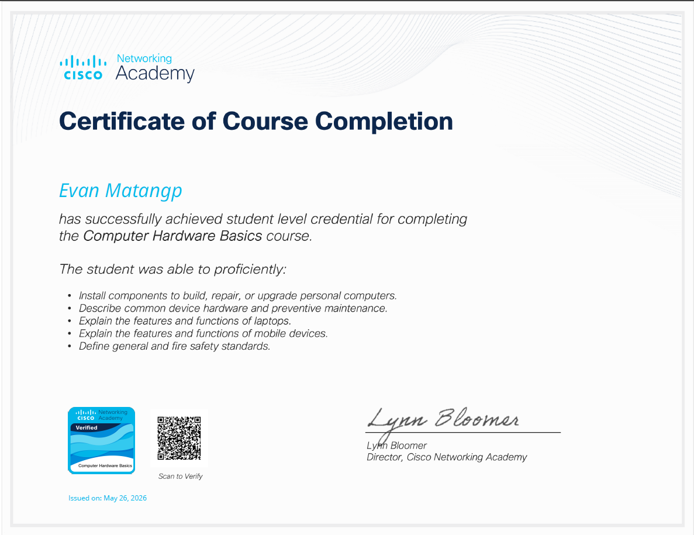
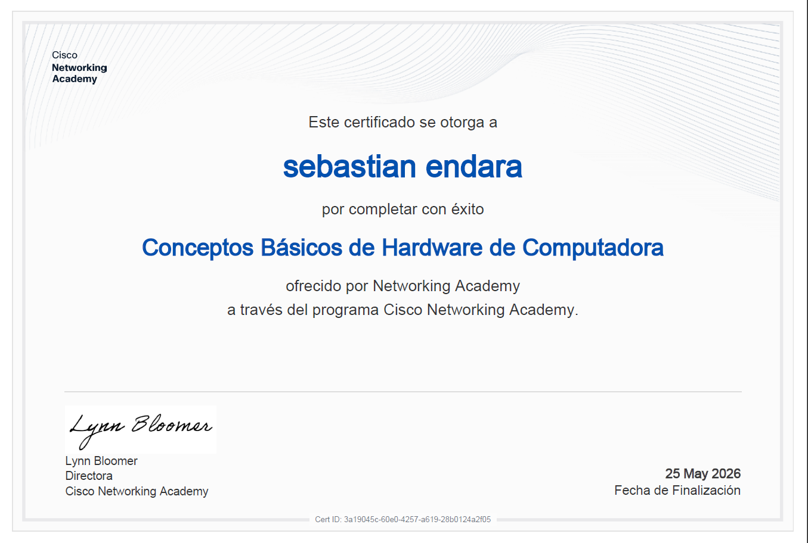
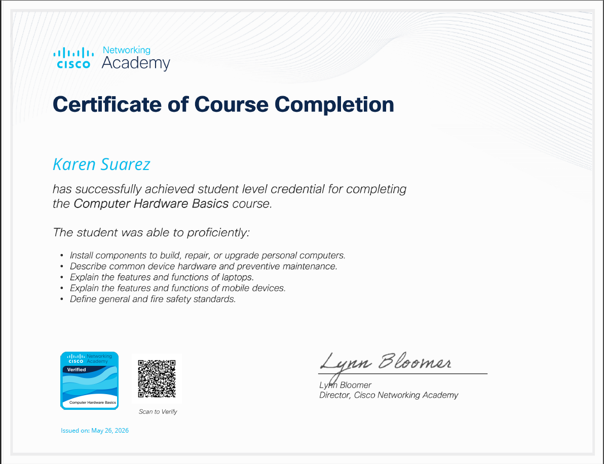
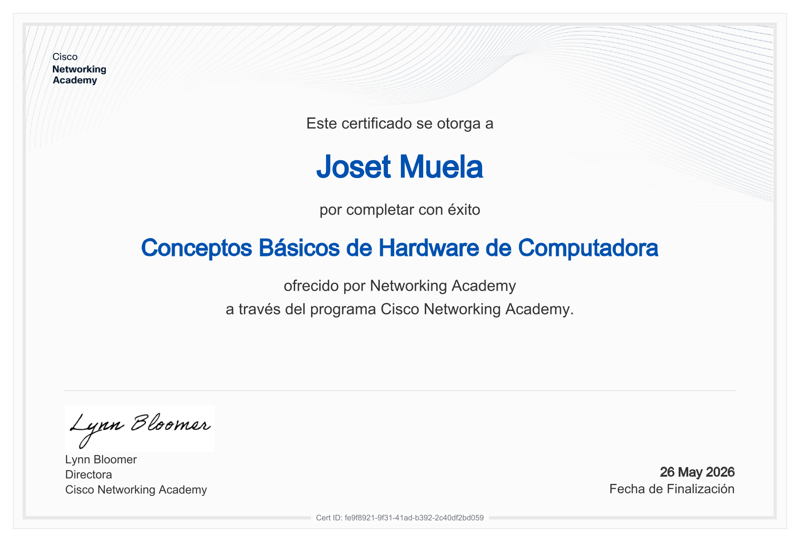

#+TITLE: Taller - Conceptos Básicos de Hardware y Ensamblaje de Computadores
#+SUBTITLE: ICCD332 Arquitectura de Computadores
#+AUTHOR: Evan Matango - Edgar Endara - Karen Suaréz - Joset Muela
#+DATE: 26-05-2026
#+OPTIONS: toc:nil num:t
#+LANGUAGE: es

#+latex_class: article
#+latex_class_options:
#+latex_header:
#+latex_header_extra:
#+description:
#+keywords:
#+subtitle:
#+latex_footnote_command: \footnote{%s%s}
#+latex_engraved_theme:
#+latex_compiler: latexmk

#+latex_header: \usepackage{fancyhdr}
#+latex_header: \usepackage[top=25mm, left=25mm, right=25mm]{geometry}
#+latex_header: \usepackage{longtable}
#+latex_header: \fancyhead[R]{}
#+latex_header: \setlength\headheight{43.0pt}
#+LATEX_HEADER: \usepackage{tabularx}
#+LATEX_HEADER: \usepackage{longtable}

#+cite_export: biblatex
#+LATEX_HEADER: \usepackage[backend=biber, style=ieee]{biblatex}
#+BIBLIOGRAPHY: ../bibliography/bibliography.bib

#+begin_export latex
\fancyhead[C]{\includegraphics[scale=0.05]{../images/logoEPN.jpg}\\
ESCUELA POLITECNICA NACIONAL\\FACULTAD DE INGENIERIA DE SISTEMAS\\
ARQUITECTURA DE COMPUTADORES}
\thispagestyle{fancy}
#+end_export

* Instrucciones generales

  Este taller se realiza en *grupos*. Cada integrante debe completar
  individualmente el curso Cisco Networking Academy:
  *Conceptos Básicos de Hardware de Computadora* y obtener su
  certificado de completitud. 

  *Entregables del grupo:*
  - Resolución de éste archivo fuente ~.org~
  - El PDF exportado desde Emacs ~M-x org-latex-export-to-pdf~
  - Los certificados individuales de cada integrante (PDF o imagen)

  *Entregable Individual(Tarea):*
  -  Resolver el cuestionario individual en el aula virtual
** Recursos
Cree su usuario en la plataforma de /Cisco Networking Academy/. Use el
siguiente enlace:

[[https://www.netacad.com/es/courses/computer-hardware-basics?courseLang=en-US][Cisco Computer Hardware Basics]]

Puede configurar según el idioma de su preferencia. El texto está
disponible en Español. Los vídeos disponen de subtítulos en varios
idiomas.

* Parte A. Integrantes y certificados
Para insertar la captura del certificado utilice YASnippet: Escriba
~fig_~ seguido de ~C-TAB~. Esto produce ~#+caption~, ~#+attr_latex~ y
~#+label~ que permiten colocar un encabezado a la imagen, controlar el
escalado de la misma y una referencia. Finalmente inserte el enlace al
archivo usando ~C-c C-l~ o usando
~[[./carpeta-certificados/cert-int1.pdf]]~
#+latex: \newpage
1. *Integrante 1*
   - *Nombre completo:* Evan Nicolás Matango Hinostrosa
   - *Correo:*evan.matango@epn.edu,ec
   - *Certificado adjunto:*  [[./Certificados/Certificado-evan.pdf][(Certificado)]]
     #+caption: Certificado de Evan Matango
     #+attr_latex: :width 0.75\textwidth
     
     
    #+latex: \newpage 
2. *Integrante 2*
   - *Nombre completo:* Endara Roldán Edgar Sebastián
   - *Correo:* edgar.endara@epn.edu.ec
   - *Certificado adjunto:*  [[./Certificados/Certificado-edgar.pdf][(Certificado)]]
     #+caption: Certificado de Edgar Endara
     #+attr_latex: :width 0.75\textwidth
     

     #+latex: \newpage
3. *Integrante 3*
   - *Nombre completo:* Karen Sofía Suárez Pacheco
   - *Correo:*karen.suarez01@epn.edu.ec
   - *Certificado adjunto:* [[./Certificados/Certificado-karen.pdf][(Certificado)]]
     #+caption: Certificado de Karen Suarérz
     #+attr_latex: :width 0.75\textwidth
     

     #+latex:\newpage
4. *Integrante 4*
   - *Nombre completo:* Joset Nicoly Muela Criollo
   - *Correo:*joset.muela@epn.edu.ec
   - *Certificado adjunto:* [[(Certificado)]]
      #+caption: Certificado de Joset Muela
      #+attr_latex: :width 0.75\textwidth
          
         

     
* Parte B. Cuestionario argumentado grupal

Para cada pregunta:

- Indique la alternativa escogida (letra).
- Escriba una justificación técnica breve (3 a 6 líneas). Fundamente
  su respuesta. Su insumo principal es el curso de Conceptos Básicos
  de Hardware. Si usa otro material referenciar.
- Discuta con el grupo de trabajo las opciones y la respuesta ¿Existió
  consenso? ¿Cuáles fueron las principales discrepancias?

*Criterio:* correcto/incorrecto + calidad del argumento técnico.

** Pregunta 1
Al instalar una CPU en un socket LGA, ¿por qué es crítico alinear el
pin 1 de la CPU con el pin 1 del socket?

a. Para que el sistema arranque con mayor rapidez 

b. Para evitar daños en la CPU y el socket al insertar incorrectamente

c. Porque el pin 1 es el único que conduce electricidad 

d. Para que el disipador quede centrado automáticamente

- /Alternativa escogida:/ b
- /Justificación técnica:/ Es importante alinear el pin 1 de la CPU
  con el pin 1 del socket, porque así se coloca en la posición
  correcta y si se inserta mal se pueden dañar los contactos del
  socket LGA o la CPU, y esto puede causar fallas al encender la
  computadora o daños permanentes en el componente.
- /Debate del grupo:/ El grupo estuvo de acuerdo en escoger la alternativa b,
  porque la CPU debe colocarse en la posición correcta antes de asegurarla en
  el socket, se descartó la opción a porque no mejora la velocidad de arranque,
  la opción c porque el pin 1 no es el único que conduce electricidad,
  y la opción d porque el disipador se instala después.
** Pregunta 2
Al montar la placa madre en el gabinete, ¿cuál es la función de los separadores (standoffs)?

a. Sostener el peso de las tarjetas de expansión

b. Evitar cortocircuitos entre la placa madre y el metal del gabinete

c. Mejorar la ventilación de la placa madre

d. Facilitar la alineación del panel de E/S trasero

- /Alternativa escogida:/ b
- /Justificación técnica:/ Los separadores sirven para que la placa
  madre no toque directamente el metal del gabinete, porque si la placa madre
  hace contacto con el metal puede producirse un cortocircuito y
  dañarse algún componente, por eso los separadores ayudan a instalar
  la placa de forma segura.
- /Debate del grupo:/ El grupo estuvo de acuerdo en escoger la
  alternativa b, porque los separadores evitan el contacto entre la
  placa madre y el gabinete, se descartó la opción a porque las
  tarjetas se sujetan en sus ranuras, la opción c porque no son para
  ventilación, y la opción d porque el panel de E/S se alinea aparte.
  

** Pregunta 3
Según el manual de ensamblaje de Cisco, ¿cuándo NO es necesario aplicar pasta térmica al instalar el disipador sobre la CPU?

a. Cuando la CPU es de alto rendimiento

b. Cuando el disipador ya incluye pasta térmica preaplicada

c. Cuando la CPU tiene más de un año de uso

d. Cuando el gabinete tiene buena ventilación

- /Alternativa escogida:/ b
- /Justificación técnica:/ No es necesario aplicar pasta térmica
  adicional cuando el disipador ya trae una capa de pasta térmica
  preaplicada de fábrica, ya que esta cumple la función de mejorar
  la transferencia de calor entre la CPU y el disipador. Aplicar más
  pasta podría afectar el rendimiento térmico.
- /Debate del grupo:/ El grupo concluyó que la opción correcta es la
  b, debido a que la pasta térmica preaplicada ya está diseñada para
  proporcionar una correcta disipación del calor sin necesidad de agregar más material.

** Pregunta 4
¿Por qué se recomienda usar pulsera antiestática y alfombrilla antiestática al manipular componentes internos?

a. Para proteger al técnico de descargas de 220 V

b. Para evitar que la electricidad estática dañe los componentes

c. Para cumplir una norma estética del laboratorio

d. Para que los tornillos no se magneticen

- /Alternativa escogida:/ b. 
- /Justificación técnica:/ Los componentes electrónicos internos de
  una computadora son sensibles a las descargas electrostáticas.
  El uso de una pulsera y una alfombrilla antiestática ayuda a
  descargar la electricidad estática del cuerpo del técnico, evitando
  daños en piezas como la memoria RAM, la placa madre o el procesador.
- /Debate del grupo:/ El grupo determinó que la respuesta correcta es
  la opción b, ya que la electricidad estática puede causar fallos
  permanentes en los componentes electrónicos durante el ensamblaje o
  mantenimiento.
** Pregunta 5
Si al iniciar la computadora por primera vez un LED del panel frontal no funciona, ¿qué indica el manual de Cisco?

a. Reemplazar el conector por uno de repuesto

b. Revisar el BIOS para habilitar el LED

c. Quitar el conector, invertirlo y volver a conectarlo

d. Desconectar y reconectar la fuente de poder

- /Alternativa escogida:/ c.
- /Justificación técnica:/ Los diodos emisores de luz (LED) del panel
  frontal funcionan mediante corriente continua y poseen polaridad.Si
  el LED no enciende tras el primer arranque generalmente se debe a
  que el conector fue instalado de forma invertida en los pines de la
  placa base, impidiendo el flujo de corriente.
- /Debate del grupo:/ El grupo determinó que la opción c es la
  respuesta correcta, ya que al ser componentes polarizados, invertir
  el conector es el procedimiento estándar de resolución de problemas
  antes de considerar un fallo físico del hardware.

** Pregunta 6
¿Por qué una GPU puede requerir un conector de alimentación PCIe adicional de la fuente de poder?

a. Porque la ranura PCIe no transmite señal de video

b. Porque las GPUs de alto rendimiento consumen más potencia de la que la ranura puede suministrar

c. Porque el conector PCIe solo funciona con tarjetas de red

d. Por el estándar de codificación de color de los cables SATA

- /Alternativa escogida:/ b.
- /Justificación técnica:/ La ranura PCle x16 está limitada a
  suministrar una potencia máxima de 75W.Las tarjetas de video de alto
  desempeño requieren un consumo energético superior para operar
  correctamente, lo que hace indispensable el uso de conectores
  adicionales provenientes directamente de la fuente de poder.
- /Debate del grupo:/ El grupo concluyó que la opción b es la
  correcta, puesto que las GPUs modernas demandan más energía de la
  que la interfaz de la placa madre puede proveer por si sola para
  mantener la estabilidad del sistema bajo carga.

* Parte C. Mantenimiento de computadores

** 3.1 Insumos para mantenimiento preventivo
   Liste al menos seis insumos y describa para qué sirve cada
   uno. Revise el siguiente [[https://youtu.be/3ri1BMV7XTM?si=bjYoDUUKuMWwj4Qg][vídeo]].

   | Insumo | Uso principal |
   |--------+---------------|
   |        |               |
   |        |               |
   |        |               |
   |        |               |
   |        |               |
   |        |               |

** 3.2 Procedimiento de limpieza — Desktop
   1.
   2.
   3.
   4.
   5.

** 3.3 Procedimiento de limpieza — Laptop
   1.
   2.
   3.
   4.
   5.

* Parte D. Aprendizaje obtenido

** Integrante 1 [Evan Matango]
   - *¿Qué conocimiento nuevo obtuvo del curso?* Con el curso
     obtuve nuevos conocimientos acerca del uso de computadoras
     ensamblajes y limpiarla, además de aprender como evitar
     accidentes al manipular componentes.
   - *¿Qué concepto corrigió o clarificó?* Me enteré que la pasta
     térmica no solo sirve para regular la temperatura de los
     componentes, sino, que también los protege.

** Integrante 2 Edgar Endara
   - *¿Qué conocimiento nuevo obtuvo del curso?* Reforcé mis
     conocimientos sobre el ensamblaje de computadoras, ya que tenía
     una idea previa sobre armar una PC y limpiar una laptop, pero el
     curso me ayudó a entender mejor el orden correcto de instalación
     y las medidas para evitar daños físicos o eléctricos.
   - *¿Qué concepto corrigió o clarificó?* Clarifiqué que los
     separadores no solo sostienen la placa madre, también evitan que
     toque el metal del gabinete y se produzcan cortocircuitos.
     
** Integrante 3 Karen Suarez
   - *¿Qué conocimiento nuevo obtuvo del curso?* Con este curso pude
     aprender cosas que no sabía y a la vez reforcé conocimientos que
     ya no me acordaba al momento de ensamblar las computadoras, que
     es muy importante aprender eso.
   - *¿Qué concepto corrigió o clarificó?* Pude clarificar que los
     componentes electrónicos pueden dañarse con voltajes tan bajos
     como 30 voltios. Porque aunque una persona no siente una descarga
     hasta aproximadamente 3000 V, los componentes internos de una
     computadora son mucho más sensibles y pueden dañarse con
     cantidades muy pequeñas de electricidad estática.

** Integrante 3 Joset Muela
   - *¿Qué conocimiento nuevo obtuvo del curso?* Con el curso puede
     adquirir conocimientos básicos que son necesarios, además de amplear
     conocimientos más tecnicos, por ejemplo sobre tipo de conexiones
     o como se pueden dar una comunicación entre un dispositivo movil
     y una computadora portátil. 
   - *¿Qué concepto corrigió o clarificó?* Gracias al curso puede
     aclarar cual es el procedimiento adecuado para desarmar y armar
     una computadora de escritorio, además me ayudo a reforzar la idea
     de que con compenentes electrónicos debemos de tener mucha
     precaución y sobre todo cuidado.
       
* Rúbrica de evaluación

  | Criterio                               | Puntaje máximo |
  |----------------------------------------+----------------|
  | Certificados individuales completos    |             20 |
  | Cuestionario: respuesta correcta (x8)  |             30 |
  | Cuestionario: argumento técnico (x8)   |             30 |
  | Mantenimiento (tabla + procedimientos) |             20 |
  | TOTAL                                  |            100 |

* ¿Cómo referenciar en Emacs?
Para insertar una referencia a un recurso bibliográfico
1. Puede actualizar el archivo ~../bibliography/bibliography.bib~
2. Escribir en formato **BibTeX** el recurso bibliográfico
3. Verifique la siguiente configuración al encabezado:
   #+begin_src org
   #+cite_export: biblatex
   #+LATEX_HEADER: \usepackage[backend=biber, style=ieee]{biblatex}
   #+BIBLIOGRAPHY: ../bibliography/bibliography.bib
   #+end_src
4. Usar ~M-x org-cite-insert~ para insertar una cita. Aparecerá una
   lista. Use los cursores para seleccionar la cita. Ejecute ~C-RET~: /De acuerdo con
   [cite:@ledin2022modern], la arquitectura ...../
5. Revise que al final del documento exista ~#+print_bibliography:~
6. **Sugerencia:** Para evitar repetir varias veces el proceso de
   exportación, es recomendable cambiar el compilador de \LaTeX a
   ~latexmk~. Para esto:
   - ~sudo apt install latexmk~
   - Revise en el encabezado del ~.org~ que el compilador escogido sea
     ~#+LATEX_COMPILER: latexmk~. También puede modificar el archivo
     ~init.el~ para indicar qué compilador se usa para exportar de
     ~.org~ a /LaTeX/:
     #+begin_src elisp
;; 4.7b Proceso de compilación con latexmk para Org-export
(with-eval-after-load 'ox-latex
  (setq org-latex-pdf-process
        '("latexmk -f -pdf -%latex -interaction=nonstopmode -output-directory=%o %f")))

;; 4.7c Org-cite: biblatex como procesador para exportación LaTeX
(with-eval-after-load 'oc
  (setq org-cite-export-processors
        '((latex biblatex)
          (t basic))))

     #+end_src
* Verificación de Entregables [0%]:
Ejecute ~C-c C-c~ sobre los ítems de tarea según se hayan cumplido o
no. Si un ítem no pudo realizarse apunte en la siguiente sección las
razones al respecto.
- [ ] Los enlaces a los certificados en el documento ~.org~ funcionan.
- [ ] Resolución completa del Cuestionario2.
- [ ] Revisión del vídeo sobre mantenimiento a computador ASUS. 
- [ ] Tutorial de Comandos Emacs realizado.
- [ ] Lista de insumos para mantenimiento completa.
- [ ] Procedimiento de mantenimiento para desktop completo.
- [ ] Procedimiento de mantenimiento para laptop completo.
- [ ] Revisión de ortografía con ~ispell-buffer~ en el buffer
- [ ] Generación de Archivo PDF ~M-x org-latex-export-to-pdf~
- [ ] Subir al aula virutal archivo ~.org~ y ~.pdf~

#+print_bibliography:
